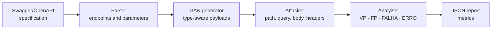

<div align="center">

# Wolff Security Scan GAN

**SQL injection vulnerability detection in REST APIs using payloads synthesized by Generative Adversarial Networks**

**English** · [Português (Brasil)](docs/i18n/README.pt-BR.md) · [Español](docs/i18n/README.es.md)

[](https://github.com/marketplace/actions/wolff-security-scan-gan)


</div>

---

## Abstract

Wolff Security Scan GAN is a dynamic application security testing (DAST) tool designed to identify SQL injection (SQLi) vulnerabilities in REST APIs. Rather than relying exclusively on static payload lists, the tool employs a Generative Adversarial Network (GAN) with recurrent (LSTM) generator and discriminator, trained on labeled datasets of SQLi payloads, to synthesize malicious inputs. Starting from the target API's Swagger/OpenAPI specification, the tool enumerates endpoints and parameters, generates payloads tailored to the type of each parameter, issues the requests, and automatically classifies the responses, producing a structured report with performance metrics. It can be run locally through a command-line interface or integrated into CI/CD pipelines as a GitHub Action.

---

## Methodology

### Pipeline overview



| Stage | Module | Description |
|-------|--------|-------------|
| 1. Specification parsing | `swagger_parser.py` | Extracts endpoints, HTTP methods and parameters from the Swagger/OpenAPI specification (YAML or JSON). |
| 2. Payload generation | `gan/generate.py`, `payloads.py` | The trained generator synthesizes SQLi payloads, tailored to the type of each parameter. |
| 3. Injection | `attacker.py` | Payloads are injected into path, query, request body and header parameters. |
| 4. Classification | `analyzer.py` | Each HTTP response is labeled according to the criteria described in *Classification criteria*. |
| 5. Reporting | `report.py` | Results and metrics are consolidated into a JSON report. |

### Model architecture

Both the generator and the discriminator are recurrent networks based on Long Short-Term Memory (LSTM) layers (`scanner/gan/models.py`). The following hyperparameters are fixed in the source code:

| Hyperparameter | Value | Description |
|----------------|-------|-------------|
| `embed_dim` | 128 | Embedding layer dimension |
| `hidden_dim` | 512 | LSTM hidden state dimension |
| `num_layers` | 3 | Number of stacked LSTM layers |
| `max_len` | 256 | Maximum sequence length |
| `lr_gen` | 1e-4 | Generator learning rate |
| `lr_disc` | 3e-4 | Discriminator learning rate |
| `teacher_forcing_ratio` | 0.5 | Fraction of steps using teacher forcing during generator training |

At inference time, sampling is controlled by a temperature parameter: higher values increase the diversity of generated payloads, potentially at the cost of a higher proportion of syntactically invalid sequences.

### Training protocol

The corpus is partitioned into training, validation and test sets in a 70/15/15 ratio, using a fixed random seed (`42`) so that the split is reproducible. Validation is performed at every epoch on a subset of up to 8 batches, and the final model is evaluated on the held-out test set. Checkpoints are saved every 50 epochs as `<output-dir>/checkpoint_epoch_<N>.pt`, and the final model is stored as `<output-dir>/gan_sqli.pt`.

### Classification criteria

Labels are emitted by the tool in Portuguese; the codes below are the exact values found in the report.

| Label | Meaning | Criterion |
|-------|---------|-----------|
| `VP` | True positive | The response contains concrete evidence of injection: database error messages, data leakage or stack traces. |
| `FP` | False positive | The response shows anomalous behavior, but without conclusive indicators of injection. |
| `FALHA` | Failure | The server rejected the payload; no evidence of vulnerability. |
| `ERRO` | Error | Connection failure or timeout. |

> [!NOTE]
> Classification is heuristic and based on response content. The `FP` label denotes suspicious responses that could not be confirmed; it does not denote false positives verified against a ground truth.

### Metrics

Let $N$ be the total number of payloads sent, $VP$ the number of true positives and $FP$ the number of false positives. The report provides:

$$\text{precision} = \frac{VP}{VP + FP} \qquad\qquad \text{efficacy} = \frac{VP}{N}$$

In addition, the report includes the absolute counts (`total_attacks`, `true_positives`, `false_positives`, `failures`, `errors`) and the total execution time (`execution_time_seconds`).

---

## Usage as a GitHub Action

Add the following step to your repository's workflow:

```yaml
- name: Wolff Security Scan GAN
  id: wolff-report
  uses: ASTRID-RESEARCH/wolff-security-scan@v1.0.2
  with:
    swagger-url: "docs/swagger.yaml"        # Local path or URL of the specification
    base-url: "http://localhost:8000"       # Base URL of the target API
    num-payloads: "200"                     # Payloads per endpoint
    temperature: "0.7"                      # Sampling temperature
    report-path: "reports/scan_report.json" # Report output path
    auth-token: ${{ secrets.API_TOKEN }}    # Authentication token (optional)
    fail-on-vuln: "true"                    # Fail the pipeline if vulnerable
```

### Inputs

| Input | Required | Default | Description |
|-------|----------|---------|-------------|
| `swagger-url` | Yes | — | URL or path of the Swagger/OpenAPI file |
| `base-url` | Yes | — | Base URL of the target API |
| `num-payloads` | No | `200` | Number of payloads per endpoint |
| `temperature` | No | `0.7` | Sampling temperature (0.1 to 1.0) |
| `report-path` | No | `reports/scan_report.json` | Report output path |
| `auth-token` | No | — | Authentication token (e.g. `Bearer abc123`) |
| `fail-on-vuln` | No | `true` | Fail the pipeline when vulnerabilities are detected |
| `python-version` | No | `3.11` | Python version |

### Outputs

| Output | Description |
|--------|-------------|
| `vulnerable` | `true` / `false` |
| `total-attacks` | Total number of payloads sent |
| `true-positives` | Number of true positives |
| `precision` | VP / (VP + FP) |
| `efficacy` | VP / total attacks |
| `execution-time` | Execution time in seconds |
| `report-path` | Path of the generated report |

When executed in a GitHub Actions environment (i.e. with the `GITHUB_OUTPUT` variable defined), the `scan` command exports these outputs automatically. The process exits with status code `1` when vulnerabilities are detected, which allows the pipeline to be interrupted.

The generated report can be preserved as a workflow artifact:

```yaml
- name: Upload report
  if: always()
  uses: actions/upload-artifact@v4
  with:
    name: wolff-security-report
    path: ${{ steps.wolff-report.outputs.report-path }}
```

---

## Local execution

This section is intended for those who wish to run the tool locally, reproduce the training, or contribute improvements.

### Requirements

- Python 3.10 or later
- CUDA (optional; recommended for training)

### Installation

```bash
git clone https://github.com/ASTRID-RESEARCH/wolff-security-scan.git
cd wolff-security-scan
pip install -r requirements.txt
```

Main dependencies: `torch` ≥ 2.0.0, `numpy` ≥ 1.24.0, `pandas` ≥ 2.0.0, `requests` ≥ 2.31.0, `pyyaml` ≥ 6.0 and `colorama` ≥ 0.4.6.

The command-line interface provides two commands, `train` and `scan`:

```bash
python main.py <command> [options]
```

### Training (`train`)

Trains the GAN on the SQLi datasets available in the `datasets/` directory.

| Parameter | Default | Description |
|-----------|---------|-------------|
| `--datasets-dir` | `datasets` | Directory containing the CSV/TXT datasets |
| `--output-dir` | `models` | Directory where the trained model is saved |
| `--epochs` | `500` | Number of training epochs |
| `--batch-size` | `256` | Batch size |
| `--resume` | — | Checkpoint path from which to resume training |
| `--train-ratio` | `0.7` | Training set proportion |
| `--val-ratio` | `0.15` | Validation set proportion |
| `--test-ratio` | `0.15` | Test set proportion |
| `--split-seed` | `42` | Random seed for the train/validation/test split |
| `--validation-max-batches` | `8` | Maximum number of batches used for validation per epoch |
| `--test-max-batches` | — | Maximum number of batches used in the final test |

```bash
# Default configuration
python main.py train

# Custom parameters
python main.py train --epochs 300 --batch-size 128

# Resume from a checkpoint
python main.py train --resume models/checkpoint_epoch_200.pt
```

### Scanning (`scan`)

Scans a REST API using payloads generated by the trained GAN.

| Parameter | Default | Description |
|-----------|---------|-------------|
| `--swagger` | **(required)** | Path of the Swagger/OpenAPI file (YAML or JSON) |
| `--base-url` | taken from the specification | Base URL of the API (overrides the specification value) |
| `--model-path` | `models/gan_sqli.pt` | Path of the trained GAN model |
| `--num-payloads` | `200` | Number of payloads generated per endpoint |
| `--temperature` | `0.7` | Sampling temperature (higher values yield more variation) |
| `--output` | `reports/scan_report.json` | Path of the output JSON report |
| `--auth-token` | — | Authentication token (e.g. `Token abc123` or `Bearer xyz`) |

```bash
# Basic scan
python main.py scan --swagger docs/api-swagger.yaml

# Authenticated scan with a custom base URL
python main.py scan \
  --swagger docs/api-swagger.yaml \
  --base-url http://localhost:8000/api \
  --auth-token "Token my_token"

# More payloads and higher variation
python main.py scan \
  --swagger docs/api-swagger.yaml \
  --num-payloads 500 \
  --temperature 0.9

# Using a specific checkpoint
python main.py scan \
  --swagger docs/api-swagger.yaml \
  --model-path models/checkpoint_epoch_300.pt
```

---

## Datasets

The `datasets/` directory must contain files with SQLi payloads in one of the following formats:

| File | Format |
|------|--------|
| `*_payload_full.csv` | Columns `payload`, `attack_type` (`sqli` / `norm`) |
| `SQLI_Dataset.csv` | Columns `Query`, `Label` (`1` = malicious) |
| `sqli-extended.csv` | Columns `Query`, `Label` |
| `*.txt` | One payload per line (all treated as malicious) |

---

## Repository structure

```
wolff-security-scan/
├── action.yml               # GitHub Action definition
├── main.py                  # Command-line interface (train / scan)
├── requirements.txt         # Python dependencies
├── datasets/                # SQLi datasets
├── models/                  # Trained models and checkpoints
├── reports/                 # Generated scan reports
├── docs/i18n/               # Translations of this document
└── scanner/
    ├── analyzer.py          # HTTP response classification
    ├── attacker.py          # Attack execution against endpoints
    ├── payloads.py          # Payload loading and generation
    ├── report.py            # JSON report generation
    ├── swagger_parser.py    # Swagger/OpenAPI parser
    └── gan/
        ├── models.py        # Generator and Discriminator architectures (LSTM)
        ├── preprocessing.py # Dataset cleaning and encoding
        ├── train.py         # GAN training loop
        └── generate.py      # Payload generation with the trained generator
```

---

## Limitations

- **Error-based detection.** A vulnerability is only identified when explicit evidence appears in the HTTP response. Vulnerabilities whose effects are not reflected in the response, such as boolean-based or time-based blind injections, or SQL errors handled internally by the application, are not detected.
- **Dependence on the specification.** Coverage is bounded by the completeness and accuracy of the Swagger/OpenAPI specification; undocumented endpoints are not evaluated.
- **Heuristic classification.** Labels are assigned from response content and are not validated against a ground truth.
- **Dependence on the training corpus.** The quality and diversity of generated payloads are conditioned by the data used to train the model.

---

## Responsible use

This tool is intended exclusively for security testing of systems owned by the user or for which explicit, written authorization has been granted. Running it against third-party systems without authorization may constitute a criminal offense in many jurisdictions. Since SQLi payloads may modify or corrupt data, scans should be performed in test or staging environments rather than in production.

---

## How to cite

If this software is used in academic work, please cite it as follows (GitHub also provides a *Cite this repository* option based on the [`CITATION.cff`](CITATION.cff) file):

```bibtex
@software{wolff_security_scan_gan,
  author  = {Maia, Pedro Ulisses},
  title   = {Wolff Security Scan GAN: SQL Injection Detection in REST APIs with GAN-Generated Payloads},
  year    = {2026},
  version = {1.0.2},
  url     = {https://github.com/ASTRID-RESEARCH/wolff-security-scan}
}
```

---

## Contributing

Contributions are welcome, including the expansion of training corpora, improvements to the model architecture, and refinement of the classification criteria. For substantial changes, please open an issue first to discuss the proposal.

## License

See the [LICENSE](LICENSE) file.

## Contact

For questions, suggestions or collaboration proposals:

- Personal: `pedro.ulisses2011@gmail.com`
- Professional: `pedro.maia@maplink.global`
