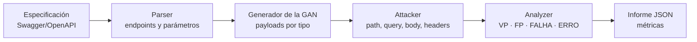

<div align="center">

# Wolff Security Scan GAN

**Detección de vulnerabilidades de inyección SQL en APIs REST mediante payloads sintetizados por Redes Generativas Antagónicas**

[English](../../README.md) · [Português (Brasil)](README.pt-BR.md) · **Español**

[](https://github.com/marketplace/actions/wolff-security-scan-gan)


</div>

---

## Resumen

Wolff Security Scan GAN es una herramienta de pruebas dinámicas de seguridad de aplicaciones (DAST) orientada a la identificación de vulnerabilidades de inyección SQL (SQLi) en APIs REST. En lugar de depender exclusivamente de listas estáticas de payloads, la herramienta emplea una Red Generativa Antagónica (GAN), con generador y discriminador recurrentes (LSTM), entrenada sobre conjuntos de datos etiquetados de payloads de SQLi, para sintetizar entradas maliciosas. A partir de la especificación Swagger/OpenAPI de la API objetivo, la herramienta enumera endpoints y parámetros, genera payloads adecuados al tipo de cada parámetro, ejecuta las solicitudes y clasifica automáticamente las respuestas, produciendo un informe estructurado con métricas de desempeño. Puede ejecutarse localmente mediante una interfaz de línea de comandos o integrarse en pipelines de CI/CD como GitHub Action.

---

## Metodología

### Visión general del pipeline



| Etapa | Módulo | Descripción |
|-------|--------|-------------|
| 1. Análisis de la especificación | `swagger_parser.py` | Extrae endpoints, métodos HTTP y parámetros de la especificación Swagger/OpenAPI (YAML o JSON). |
| 2. Generación de payloads | `gan/generate.py`, `payloads.py` | El generador entrenado sintetiza payloads de SQLi adecuados al tipo de cada parámetro. |
| 3. Inyección | `attacker.py` | Los payloads se inyectan en parámetros de path, query, cuerpo de la solicitud y cabeceras. |
| 4. Clasificación | `analyzer.py` | Cada respuesta HTTP se etiqueta según los criterios descritos en *Criterios de clasificación*. |
| 5. Informe | `report.py` | Los resultados y las métricas se consolidan en un informe JSON. |

### Arquitectura del modelo

El generador y el discriminador son redes recurrentes basadas en capas Long Short-Term Memory (LSTM) (`scanner/gan/models.py`). Los siguientes hiperparámetros están fijados en el código fuente:

| Hiperparámetro | Valor | Descripción |
|----------------|-------|-------------|
| `embed_dim` | 128 | Dimensión de la capa de embedding |
| `hidden_dim` | 512 | Dimensión del estado oculto de las LSTM |
| `num_layers` | 3 | Número de capas LSTM apiladas |
| `max_len` | 256 | Longitud máxima de las secuencias |
| `lr_gen` | 1e-4 | Tasa de aprendizaje del generador |
| `lr_disc` | 3e-4 | Tasa de aprendizaje del discriminador |
| `teacher_forcing_ratio` | 0.5 | Proporción de pasos con *teacher forcing* durante el entrenamiento del generador |

En la inferencia, el muestreo se controla mediante el parámetro de temperatura: valores más altos aumentan la diversidad de los payloads generados, posiblemente a costa de una mayor proporción de secuencias sintácticamente inválidas.

### Protocolo de entrenamiento

El corpus se divide en conjuntos de entrenamiento, validación y prueba en una proporción de 70/15/15, con una semilla aleatoria fija (`42`) que garantiza la reproducibilidad de la división. La validación se realiza en cada época sobre un subconjunto de hasta 8 batches, y el modelo final se evalúa en el conjunto de prueba reservado. Los checkpoints se guardan cada 50 épocas en `<output-dir>/checkpoint_epoch_<N>.pt`, y el modelo final se almacena en `<output-dir>/gan_sqli.pt`.

### Criterios de clasificación

La herramienta emite las etiquetas en portugués; los códigos siguientes son los valores exactos que aparecen en el informe.

| Etiqueta | Significado | Criterio |
|----------|-------------|----------|
| `VP` | Verdadero positivo | La respuesta contiene evidencia concreta de inyección: mensajes de error del SGBD, fuga de datos o stack traces. |
| `FP` | Falso positivo | La respuesta presenta un comportamiento anómalo, pero sin indicadores concluyentes de inyección. |
| `FALHA` | Fallo | El servidor rechazó el payload; no hay indicios de vulnerabilidad. |
| `ERRO` | Error | Fallo de conexión o tiempo de espera agotado. |

> [!NOTE]
> La clasificación es heurística y se basa en el contenido de la respuesta. La etiqueta `FP` designa respuestas sospechosas que no pudieron confirmarse, y no falsos positivos verificados frente a una verdad de referencia (*ground truth*).

### Métricas

Sean $N$ el número total de payloads enviados, $VP$ el número de verdaderos positivos y $FP$ el número de falsos positivos. El informe presenta:

$$\text{precisión} = \frac{VP}{VP + FP} \qquad\qquad \text{eficacia} = \frac{VP}{N}$$

Además, el informe incluye los recuentos absolutos (`total_attacks`, `true_positives`, `false_positives`, `failures`, `errors`) y el tiempo total de ejecución (`execution_time_seconds`).

---

## Uso como GitHub Action

Añada el siguiente paso al workflow de su repositorio:

```yaml
- name: Wolff Security Scan GAN
  id: wolff-report
  uses: ASTRID-RESEARCH/wolff-security-scan@v1.0.2
  with:
    swagger-url: "docs/swagger.yaml"        # Ruta local o URL de la especificación
    base-url: "http://localhost:8000"       # URL base de la API objetivo
    num-payloads: "200"                     # Payloads por endpoint
    temperature: "0.7"                      # Temperatura de muestreo
    report-path: "reports/scan_report.json" # Ruta del informe
    auth-token: ${{ secrets.API_TOKEN }}    # Token de autenticación (opcional)
    fail-on-vuln: "true"                    # Interrumpir el pipeline si hay vulnerabilidades
```

### Entradas (*inputs*)

| Entrada | Obligatoria | Valor por defecto | Descripción |
|---------|-------------|-------------------|-------------|
| `swagger-url` | Sí | — | URL o ruta del archivo Swagger/OpenAPI |
| `base-url` | Sí | — | URL base de la API objetivo |
| `num-payloads` | No | `200` | Número de payloads por endpoint |
| `temperature` | No | `0.7` | Temperatura de muestreo (0.1 a 1.0) |
| `report-path` | No | `reports/scan_report.json` | Ruta del informe |
| `auth-token` | No | — | Token de autenticación (p. ej., `Bearer abc123`) |
| `fail-on-vuln` | No | `true` | Interrumpir el pipeline cuando se detecten vulnerabilidades |
| `python-version` | No | `3.11` | Versión de Python |

### Salidas (*outputs*)

| Salida | Descripción |
|--------|-------------|
| `vulnerable` | `true` / `false` |
| `total-attacks` | Número total de payloads enviados |
| `true-positives` | Número de verdaderos positivos |
| `precision` | VP / (VP + FP) |
| `efficacy` | VP / total de ataques |
| `execution-time` | Tiempo de ejecución en segundos |
| `report-path` | Ruta del informe generado |

Cuando se ejecuta en un entorno de GitHub Actions (es decir, con la variable `GITHUB_OUTPUT` definida), el comando `scan` exporta estas salidas automáticamente. El proceso finaliza con código de salida `1` cuando se detectan vulnerabilidades, lo que permite interrumpir el pipeline.

El informe generado puede conservarse como artefacto del workflow:

```yaml
- name: Publicar informe
  if: always()
  uses: actions/upload-artifact@v4
  with:
    name: wolff-security-report
    path: ${{ steps.wolff-report.outputs.report-path }}
```

---

## Ejecución local

Esta sección está dirigida a quienes deseen ejecutar la herramienta localmente, reproducir el entrenamiento o contribuir con mejoras.

### Requisitos

- Python 3.10 o superior
- CUDA (opcional; recomendado para el entrenamiento)

### Instalación

```bash
git clone https://github.com/ASTRID-RESEARCH/wolff-security-scan.git
cd wolff-security-scan
pip install -r requirements.txt
```

Dependencias principales: `torch` ≥ 2.0.0, `numpy` ≥ 1.24.0, `pandas` ≥ 2.0.0, `requests` ≥ 2.31.0, `pyyaml` ≥ 6.0 y `colorama` ≥ 0.4.6.

La interfaz de línea de comandos ofrece dos comandos, `train` y `scan`:

```bash
python main.py <comando> [opciones]
```

### Entrenamiento (`train`)

Entrena la GAN sobre los conjuntos de datos de SQLi disponibles en el directorio `datasets/`.

| Parámetro | Valor por defecto | Descripción |
|-----------|-------------------|-------------|
| `--datasets-dir` | `datasets` | Directorio con los conjuntos de datos CSV/TXT |
| `--output-dir` | `models` | Directorio donde se guarda el modelo entrenado |
| `--epochs` | `500` | Número de épocas de entrenamiento |
| `--batch-size` | `256` | Tamaño del batch |
| `--resume` | — | Ruta de un checkpoint desde el cual reanudar el entrenamiento |
| `--train-ratio` | `0.7` | Proporción del conjunto de entrenamiento |
| `--val-ratio` | `0.15` | Proporción del conjunto de validación |
| `--test-ratio` | `0.15` | Proporción del conjunto de prueba |
| `--split-seed` | `42` | Semilla aleatoria de la división entrenamiento/validación/prueba |
| `--validation-max-batches` | `8` | Número máximo de batches usados en la validación por época |
| `--test-max-batches` | — | Número máximo de batches usados en la prueba final |

```bash
# Configuración por defecto
python main.py train

# Parámetros personalizados
python main.py train --epochs 300 --batch-size 128

# Reanudación desde un checkpoint
python main.py train --resume models/checkpoint_epoch_200.pt
```

### Escaneo (`scan`)

Escanea una API REST con payloads generados por la GAN entrenada.

| Parámetro | Valor por defecto | Descripción |
|-----------|-------------------|-------------|
| `--swagger` | **(obligatorio)** | Ruta del archivo Swagger/OpenAPI (YAML o JSON) |
| `--base-url` | obtenido de la especificación | URL base de la API (sobrescribe el valor de la especificación) |
| `--model-path` | `models/gan_sqli.pt` | Ruta del modelo GAN entrenado |
| `--num-payloads` | `200` | Número de payloads generados por endpoint |
| `--temperature` | `0.7` | Temperatura de muestreo (valores mayores producen más variación) |
| `--output` | `reports/scan_report.json` | Ruta del informe JSON de salida |
| `--auth-token` | — | Token de autenticación (p. ej., `Token abc123` o `Bearer xyz`) |

```bash
# Escaneo básico
python main.py scan --swagger docs/api-swagger.yaml

# Escaneo autenticado con URL base personalizada
python main.py scan \
  --swagger docs/api-swagger.yaml \
  --base-url http://localhost:8000/api \
  --auth-token "Token mi_token"

# Más payloads y mayor variación
python main.py scan \
  --swagger docs/api-swagger.yaml \
  --num-payloads 500 \
  --temperature 0.9

# Uso de un checkpoint específico
python main.py scan \
  --swagger docs/api-swagger.yaml \
  --model-path models/checkpoint_epoch_300.pt
```

---

## Conjuntos de datos

El directorio `datasets/` debe contener archivos con payloads de SQLi en alguno de los siguientes formatos:

| Archivo | Formato |
|---------|---------|
| `*_payload_full.csv` | Columnas `payload`, `attack_type` (`sqli` / `norm`) |
| `SQLI_Dataset.csv` | Columnas `Query`, `Label` (`1` = malicioso) |
| `sqli-extended.csv` | Columnas `Query`, `Label` |
| `*.txt` | Un payload por línea (todos tratados como maliciosos) |

---

## Estructura del repositorio

```
wolff-security-scan/
├── action.yml               # Definición de la GitHub Action
├── main.py                  # Interfaz de línea de comandos (train / scan)
├── requirements.txt         # Dependencias de Python
├── datasets/                # Conjuntos de datos de SQLi
├── models/                  # Modelos entrenados y checkpoints
├── reports/                 # Informes de escaneo generados
├── docs/i18n/               # Traducciones de este documento
└── scanner/
    ├── analyzer.py          # Clasificación de las respuestas HTTP
    ├── attacker.py          # Ejecución de los ataques contra los endpoints
    ├── payloads.py          # Carga y generación de payloads
    ├── report.py            # Generación de informes JSON
    ├── swagger_parser.py    # Parser de Swagger/OpenAPI
    └── gan/
        ├── models.py        # Arquitecturas del generador y del discriminador (LSTM)
        ├── preprocessing.py # Limpieza y codificación de los conjuntos de datos
        ├── train.py         # Bucle de entrenamiento de la GAN
        └── generate.py      # Generación de payloads con el generador entrenado
```

---

## Limitaciones

- **Detección basada en errores.** Una vulnerabilidad solo se identifica cuando existe evidencia explícita en la respuesta HTTP. Las vulnerabilidades cuyos efectos no se reflejan en la respuesta, como las inyecciones ciegas (*blind*) booleanas o basadas en tiempo, o los errores de SQL gestionados internamente por la aplicación, no se detectan.
- **Dependencia de la especificación.** La cobertura está limitada por la completitud y la exactitud de la especificación Swagger/OpenAPI; los endpoints no documentados no se evalúan.
- **Clasificación heurística.** Las etiquetas se asignan a partir del contenido de la respuesta y no se validan frente a una verdad de referencia.
- **Dependencia del corpus de entrenamiento.** La calidad y la diversidad de los payloads generados están condicionadas por los datos utilizados para entrenar el modelo.

---

## Uso responsable

Esta herramienta está destinada exclusivamente a pruebas de seguridad sobre sistemas propios o para los cuales se cuente con autorización expresa y por escrito. Su ejecución contra sistemas de terceros sin autorización puede constituir un delito en numerosas jurisdicciones. Dado que los payloads de SQLi pueden modificar o corromper datos, se recomienda realizar los escaneos en entornos de prueba o preproducción, y no en producción.

---

## Cómo citar

Si este software se utiliza en trabajos académicos, se solicita citarlo de la siguiente manera (GitHub también ofrece la opción *Cite this repository*, basada en el archivo [`CITATION.cff`](../../CITATION.cff)):

```bibtex
@software{wolff_security_scan_gan,
  author  = {Maia, Pedro Ulisses},
  title   = {Wolff Security Scan GAN: SQL Injection Detection in REST APIs with GAN-Generated Payloads},
  year    = {2026},
  version = {1.0.2},
  url     = {https://github.com/ASTRID-RESEARCH/wolff-security-scan}
}
```

---

## Contribuciones

Las contribuciones son bienvenidas, incluida la ampliación de los corpus de entrenamiento, mejoras en la arquitectura del modelo y el refinamiento de los criterios de clasificación. Para cambios sustanciales, se recomienda abrir previamente un *issue* para discutir la propuesta.

## Licencia

Consulte el archivo [LICENSE](../../LICENSE).

## Contacto

Para dudas, sugerencias o propuestas de colaboración:

- Personal: `pedro.ulisses2011@gmail.com`
- Profesional: `pedro.maia@maplink.global`
