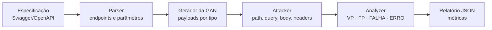

<div align="center">

# Wolff Security Scan GAN

**Detecção de vulnerabilidades de injeção de SQL em APIs REST por meio de payloads sintetizados por Redes Adversariais Generativas**

[English](../../README.md) · **Português (Brasil)** · [Español](README.es.md)

[](https://github.com/marketplace/actions/wolff-security-scan-gan)


</div>

---

## Resumo

O Wolff Security Scan GAN é uma ferramenta de teste dinâmico de segurança de aplicações (DAST) voltada à identificação de vulnerabilidades de injeção de SQL (SQLi) em APIs REST. Em vez de depender exclusivamente de listas estáticas de payloads, a ferramenta emprega uma Rede Adversarial Generativa (GAN), com gerador e discriminador recorrentes (LSTM), treinada sobre conjuntos de dados rotulados de payloads de SQLi, para sintetizar entradas maliciosas. A partir da especificação Swagger/OpenAPI da API alvo, a ferramenta enumera endpoints e parâmetros, gera payloads adequados ao tipo de cada parâmetro, executa as requisições e classifica automaticamente as respostas, produzindo um relatório estruturado com métricas de desempenho. A ferramenta pode ser executada localmente, por meio de interface de linha de comando, ou integrada a pipelines de CI/CD como GitHub Action.

---

## Metodologia

### Visão geral do pipeline



| Etapa | Módulo | Descrição |
|-------|--------|-----------|
| 1. Análise da especificação | `swagger_parser.py` | Extrai endpoints, métodos HTTP e parâmetros da especificação Swagger/OpenAPI (YAML ou JSON). |
| 2. Geração de payloads | `gan/generate.py`, `payloads.py` | O gerador treinado sintetiza payloads de SQLi adequados ao tipo de cada parâmetro. |
| 3. Injeção | `attacker.py` | Os payloads são injetados em parâmetros de path, query, corpo da requisição e cabeçalhos. |
| 4. Classificação | `analyzer.py` | Cada resposta HTTP é rotulada segundo os critérios descritos em *Critérios de classificação*. |
| 5. Relatório | `report.py` | Os resultados e as métricas são consolidados em um relatório JSON. |

### Arquitetura do modelo

O gerador e o discriminador são redes recorrentes baseadas em camadas Long Short-Term Memory (LSTM) (`scanner/gan/models.py`). Os hiperparâmetros a seguir são fixos no código-fonte:

| Hiperparâmetro | Valor | Descrição |
|----------------|-------|-----------|
| `embed_dim` | 128 | Dimensão da camada de embedding |
| `hidden_dim` | 512 | Dimensão do estado oculto das LSTMs |
| `num_layers` | 3 | Número de camadas LSTM empilhadas |
| `max_len` | 256 | Comprimento máximo das sequências |
| `lr_gen` | 1e-4 | Taxa de aprendizado do gerador |
| `lr_disc` | 3e-4 | Taxa de aprendizado do discriminador |
| `teacher_forcing_ratio` | 0.5 | Proporção de passos com *teacher forcing* no treinamento do gerador |

Na inferência, a amostragem é controlada pelo parâmetro de temperatura: valores mais altos aumentam a diversidade dos payloads gerados, possivelmente ao custo de uma proporção maior de sequências sintaticamente inválidas.

### Protocolo de treinamento

O corpus é particionado em conjuntos de treinamento, validação e teste na proporção 70/15/15, com semente aleatória fixa (`42`), o que garante a reprodutibilidade da divisão. A validação é realizada a cada época sobre um subconjunto de até 8 batches, e o modelo final é avaliado no conjunto de teste reservado. Checkpoints são salvos a cada 50 épocas em `<output-dir>/checkpoint_epoch_<N>.pt`, e o modelo final é armazenado em `<output-dir>/gan_sqli.pt`.

### Critérios de classificação

| Rótulo | Significado | Critério |
|--------|-------------|----------|
| `VP` | Verdadeiro positivo | A resposta contém evidência concreta de injeção: mensagens de erro do SGBD, vazamento de dados ou stack traces. |
| `FP` | Falso positivo | A resposta apresenta comportamento anômalo, porém sem indicadores conclusivos de injeção. |
| `FALHA` | Falha | O servidor rejeitou o payload; não há indício de vulnerabilidade. |
| `ERRO` | Erro | Falha de conexão ou tempo de espera excedido. |

> [!NOTE]
> A classificação é heurística e baseada no conteúdo da resposta. O rótulo `FP` designa respostas suspeitas que não puderam ser confirmadas, e não falsos positivos verificados contra uma verdade de referência (*ground truth*).

### Métricas

Sejam $N$ o número total de payloads enviados, $VP$ o número de verdadeiros positivos e $FP$ o número de falsos positivos. O relatório apresenta:

$$\text{precisão} = \frac{VP}{VP + FP} \qquad\qquad \text{eficácia} = \frac{VP}{N}$$

Além disso, o relatório inclui as contagens absolutas (`total_attacks`, `true_positives`, `false_positives`, `failures`, `errors`) e o tempo total de execução (`execution_time_seconds`).

---

## Uso como GitHub Action

Adicione o passo a seguir ao workflow do seu repositório:

```yaml
- name: Wolff Security Scan GAN
  id: wolff-report
  uses: ASTRID-RESEARCH/wolff-security-scan@v1.0.2
  with:
    swagger-url: "docs/swagger.yaml"        # Caminho local ou URL da especificação
    base-url: "http://localhost:8000"       # URL base da API alvo
    num-payloads: "200"                     # Payloads por endpoint
    temperature: "0.7"                      # Temperatura de amostragem
    report-path: "reports/scan_report.json" # Caminho do relatório
    auth-token: ${{ secrets.API_TOKEN }}    # Token de autenticação (opcional)
    fail-on-vuln: "true"                    # Interromper o pipeline se houver vulnerabilidade
```

### Entradas (*inputs*)

| Entrada | Obrigatória | Padrão | Descrição |
|---------|-------------|--------|-----------|
| `swagger-url` | Sim | — | URL ou caminho do arquivo Swagger/OpenAPI |
| `base-url` | Sim | — | URL base da API alvo |
| `num-payloads` | Não | `200` | Número de payloads por endpoint |
| `temperature` | Não | `0.7` | Temperatura de amostragem (0.1 a 1.0) |
| `report-path` | Não | `reports/scan_report.json` | Caminho do relatório |
| `auth-token` | Não | — | Token de autenticação (ex.: `Bearer abc123`) |
| `fail-on-vuln` | Não | `true` | Interromper o pipeline quando vulnerabilidades forem detectadas |
| `python-version` | Não | `3.11` | Versão do Python |

### Saídas (*outputs*)

| Saída | Descrição |
|-------|-----------|
| `vulnerable` | `true` / `false` |
| `total-attacks` | Número total de payloads enviados |
| `true-positives` | Número de verdadeiros positivos |
| `precision` | VP / (VP + FP) |
| `efficacy` | VP / total de ataques |
| `execution-time` | Tempo de execução em segundos |
| `report-path` | Caminho do relatório gerado |

Quando executado em ambiente GitHub Actions (isto é, com a variável `GITHUB_OUTPUT` definida), o comando `scan` exporta essas saídas automaticamente. O processo encerra com código de saída `1` quando vulnerabilidades são detectadas, o que permite interromper o pipeline.

O relatório gerado pode ser preservado como artefato do workflow:

```yaml
- name: Publicar relatório
  if: always()
  uses: actions/upload-artifact@v4
  with:
    name: wolff-security-report
    path: ${{ steps.wolff-report.outputs.report-path }}
```

---

## Execução local

Esta seção destina-se a quem deseja executar a ferramenta localmente, reproduzir o treinamento ou contribuir com melhorias.

### Requisitos

- Python 3.10 ou superior
- CUDA (opcional; recomendado para o treinamento)

### Instalação

```bash
git clone https://github.com/ASTRID-RESEARCH/wolff-security-scan.git
cd wolff-security-scan
pip install -r requirements.txt
```

Dependências principais: `torch` ≥ 2.0.0, `numpy` ≥ 1.24.0, `pandas` ≥ 2.0.0, `requests` ≥ 2.31.0, `pyyaml` ≥ 6.0 e `colorama` ≥ 0.4.6.

A interface de linha de comando oferece dois comandos, `train` e `scan`:

```bash
python main.py <comando> [opções]
```

### Treinamento (`train`)

Treina a GAN sobre os conjuntos de dados de SQLi disponíveis no diretório `datasets/`.

| Parâmetro | Padrão | Descrição |
|-----------|--------|-----------|
| `--datasets-dir` | `datasets` | Diretório com os conjuntos de dados CSV/TXT |
| `--output-dir` | `models` | Diretório em que o modelo treinado é salvo |
| `--epochs` | `500` | Número de épocas de treinamento |
| `--batch-size` | `256` | Tamanho do batch |
| `--resume` | — | Caminho de um checkpoint a partir do qual o treinamento é retomado |
| `--train-ratio` | `0.7` | Proporção do conjunto de treinamento |
| `--val-ratio` | `0.15` | Proporção do conjunto de validação |
| `--test-ratio` | `0.15` | Proporção do conjunto de teste |
| `--split-seed` | `42` | Semente aleatória da divisão treinamento/validação/teste |
| `--validation-max-batches` | `8` | Número máximo de batches usados na validação a cada época |
| `--test-max-batches` | — | Número máximo de batches usados no teste final |

```bash
# Configuração padrão
python main.py train

# Parâmetros personalizados
python main.py train --epochs 300 --batch-size 128

# Retomada a partir de um checkpoint
python main.py train --resume models/checkpoint_epoch_200.pt
```

### Varredura (`scan`)

Realiza a varredura de uma API REST com payloads gerados pela GAN treinada.

| Parâmetro | Padrão | Descrição |
|-----------|--------|-----------|
| `--swagger` | **(obrigatório)** | Caminho do arquivo Swagger/OpenAPI (YAML ou JSON) |
| `--base-url` | obtido da especificação | URL base da API (sobrescreve o valor da especificação) |
| `--model-path` | `models/gan_sqli.pt` | Caminho do modelo GAN treinado |
| `--num-payloads` | `200` | Número de payloads gerados por endpoint |
| `--temperature` | `0.7` | Temperatura de amostragem (valores maiores produzem mais variação) |
| `--output` | `reports/scan_report.json` | Caminho do relatório JSON de saída |
| `--auth-token` | — | Token de autenticação (ex.: `Token abc123` ou `Bearer xyz`) |

```bash
# Varredura básica
python main.py scan --swagger docs/api-swagger.yaml

# Varredura autenticada com URL base personalizada
python main.py scan \
  --swagger docs/api-swagger.yaml \
  --base-url http://localhost:8000/api \
  --auth-token "Token meu_token"

# Mais payloads e maior variação
python main.py scan \
  --swagger docs/api-swagger.yaml \
  --num-payloads 500 \
  --temperature 0.9

# Uso de um checkpoint específico
python main.py scan \
  --swagger docs/api-swagger.yaml \
  --model-path models/checkpoint_epoch_300.pt
```

---

## Conjuntos de dados

O diretório `datasets/` deve conter arquivos com payloads de SQLi em um dos formatos a seguir:

| Arquivo | Formato |
|---------|---------|
| `*_payload_full.csv` | Colunas `payload`, `attack_type` (`sqli` / `norm`) |
| `SQLI_Dataset.csv` | Colunas `Query`, `Label` (`1` = malicioso) |
| `sqli-extended.csv` | Colunas `Query`, `Label` |
| `*.txt` | Um payload por linha (todos tratados como maliciosos) |

---

## Estrutura do repositório

```
wolff-security-scan/
├── action.yml               # Definição da GitHub Action
├── main.py                  # Interface de linha de comando (train / scan)
├── requirements.txt         # Dependências Python
├── datasets/                # Conjuntos de dados de SQLi
├── models/                  # Modelos treinados e checkpoints
├── reports/                 # Relatórios de varredura gerados
├── docs/i18n/               # Traduções deste documento
└── scanner/
    ├── analyzer.py          # Classificação das respostas HTTP
    ├── attacker.py          # Execução dos ataques nos endpoints
    ├── payloads.py          # Carregamento e geração de payloads
    ├── report.py            # Geração dos relatórios JSON
    ├── swagger_parser.py    # Parser de Swagger/OpenAPI
    └── gan/
        ├── models.py        # Arquiteturas do gerador e do discriminador (LSTM)
        ├── preprocessing.py # Limpeza e codificação dos conjuntos de dados
        ├── train.py         # Laço de treinamento da GAN
        └── generate.py      # Geração de payloads com o gerador treinado
```

---

## Limitações

- **Detecção baseada em erros.** Uma vulnerabilidade só é identificada quando há evidência explícita na resposta HTTP. Vulnerabilidades cujos efeitos não se refletem na resposta, como injeções cegas (*blind*) booleanas ou baseadas em tempo, ou erros de SQL tratados internamente pela aplicação, não são detectadas.
- **Dependência da especificação.** A cobertura é limitada pela completude e pela exatidão da especificação Swagger/OpenAPI; endpoints não documentados não são avaliados.
- **Classificação heurística.** Os rótulos são atribuídos a partir do conteúdo da resposta e não são validados contra uma verdade de referência.
- **Dependência do corpus de treinamento.** A qualidade e a diversidade dos payloads gerados são condicionadas pelos dados utilizados no treinamento do modelo.

---

## Uso responsável

Esta ferramenta destina-se exclusivamente a testes de segurança em sistemas próprios ou para os quais haja autorização expressa e por escrito. Sua execução contra sistemas de terceiros sem autorização pode configurar crime (no Brasil, por exemplo, nos termos da Lei nº 12.737/2012). Como payloads de SQLi podem alterar ou corromper dados, recomenda-se realizar as varreduras em ambientes de teste ou homologação, e não em produção.

---

## Como citar

Caso este software seja utilizado em trabalhos acadêmicos, solicita-se a citação a seguir (o GitHub também disponibiliza a opção *Cite this repository*, com base no arquivo [`CITATION.cff`](../../CITATION.cff)):

```bibtex
@software{wolff_security_scan_gan,
  author  = {Maia, Pedro Ulisses},
  title   = {Wolff Security Scan GAN: SQL Injection Detection in REST APIs with GAN-Generated Payloads},
  year    = {2026},
  version = {1.0.2},
  url     = {https://github.com/ASTRID-RESEARCH/wolff-security-scan}
}
```

---

## Contribuições

Contribuições são bem-vindas, incluindo a ampliação dos corpora de treinamento, melhorias na arquitetura do modelo e o refinamento dos critérios de classificação. Para alterações substanciais, recomenda-se abrir previamente uma *issue* para discussão da proposta.

## Licença

Consulte o arquivo [LICENSE](../../LICENSE).

## Contato

Para dúvidas, sugestões ou propostas de colaboração:

- Pessoal: `pedro.ulisses2011@gmail.com`
- Profissional: `pedro.maia@maplink.global`
